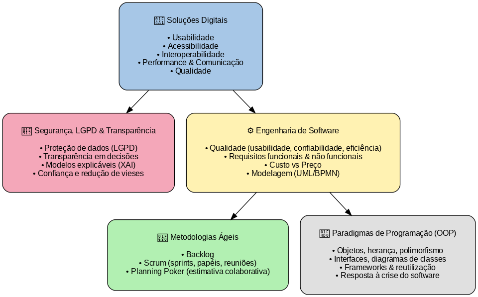

# Resumo Crítico: PIPE Start, Inovação em Software e Transparência

---

## **PIPE Start (FAPESP)**

* Incentiva pequenas empresas a desenvolverem **pesquisa inovadora**.
* Foco em **inovação tecnológica**, aplicabilidade de mercado e **formação de competências**.
* Estimula **networking** entre pesquisadores, empreendedores e investidores.

---

## **Eventos e Networking**

* Eventos fortalecem conexões profissionais.
* Criam oportunidades de aprendizado contínuo e troca de experiências.
* Impacto direto na **profundidade técnica** e na **qualidade das soluções** desenvolvidas.

---

## **Soluções Digitais: Requisitos-Chave**

* **Usabilidade**: interface simples e intuitiva.
* **Acessibilidade**: inclusão de usuários com diferentes necessidades.
* **Interoperabilidade**: integração entre sistemas.
* **Performance & Comunicação**: eficiência técnica e clareza na troca de informações.
* **Qualidade**: confiabilidade, manutenibilidade e escalabilidade.

---

## **Segurança, LGPD e Transparência**

* **Proteção de dados pessoais** é requisito obrigatório (LGPD).
* Empresas devem ser **transparentes nas decisões automatizadas**.
* Exigência de **modelos explicáveis de aprendizado de máquina (XAI)**.
* Transparência aumenta a confiança e reduz riscos de vieses.

---

## **Engenharia de Software**

* **Qualidade**: atender expectativas (usabilidade, confiabilidade, eficiência).
* **Requisitos**:
  * Funcionais → o que o sistema faz.
  * Não funcionais → como o sistema deve se comportar (desempenho, segurança, portabilidade).
* **Custo vs. Preço**: equilibrar investimento em desenvolvimento com valor de mercado.
* **Modelagem**: uso de UML, BPMN para comunicação e documentação.

---

## **Metodologias Ágeis**

* **Backlog**: lista priorizada de funcionalidades.
* **Scrum**: sprints curtos, entregas incrementais.
  * **Papéis**: Product Owner, Scrum Master, Time de Desenvolvimento.
  * **Reuniões**: Planning, Daily, Review, Retrospective.
* **Planning Poker**: estimativa colaborativa usando valores (Fibonacci, ?, pausa).
  * **Benefícios**: consenso, engajamento, estimativas mais realistas.

---

## **Paradigmas de Programação e OOP**

* **Orientação a Objetos (POO)**: encapsulamento, polimorfismo, herança.
* **Interfaces e diagramas de classes**: facilitam organização e extensibilidade.
* **Frameworks**: permitem reutilização e evolução de sistemas.
* Resposta à **“crise do software”** → sistemas mais organizados, adaptáveis e alinhados ao mundo real.

---

---
